# ships-vehicles-designer

**Mneme Ships and Vehicles Designer**

A mass-based, delta-V-centric spacecraft and vehicle construction framework for the [Mneme](https://github.com/Game-in-the-Brain) setting. Compatible with Cepheus Engine / Traveller-style tabletop RPGs.

## Overview

This repository contains the **Mneme Ship Design System (MSDS)** — a physically grounded engineering framework that replaces the traditional displacement-ton abstraction with realistic mass budgets, propulsion analysis, and procedural generation.

The system serves as:
- **Reference tool** — model historical rockets (Saturn V, N1, Energia-Buran, Falcon 9, SLS, Starship)
- **Design tool** — build new vehicles within realistic engineering envelopes
- **Mini-game substrate** — simulate political, financial, and human-capital tradeoffs of space programs
- **Procedural generator** — seed-based creation of companies, engineers, and programs with Features and Bugs

## Core Philosophy

> *The physics is non-negotiable; the politics is everything.*

## Documentation

- **[Mneme Ship Design System](Mneme_Ship_Design_System.md)** — Complete v0.1 specification covering:
  - Decimal Technology Level (TL) framework
  - Vehicle taxonomy and mission leg structure
  - Mass budget & delta-V mechanics (Tsiolkovsky rocket equation)
  - Bill of Materials (BOM) structure
  - Propulsion reference tables
  - Features, Bugs & Program Maturity system
  - Procedural generation for nations, organizations, and programs
  - Saturn V reference calibration data
  - PWA / App feature roadmap

## Project Status

- **Current Version:** v0.1 Draft
- **Baseline Vehicle:** Saturn V (TL 7.4) — calibration anchor established
- **Next Milestone:** PWA BOM calculator with Saturn V validation, then N1 procedural comparison

## Related Projects

- [Mneme World Generator](https://github.com/Game-in-the-Brain/Mneme-CE-World-Generator)
- [Name-Place-Faction Generator](https://github.com/Game-in-the-Brain/name-place-faction-generator)
- [Cepheus Engine Character Generator](https://github.com/Game-in-the-Brain/cecharactergen)

## License

This project is licensed under the [GNU Affero General Public License v3.0](LICENSE) (AGPL-3.0).

---

*Part of the Game in the Brain / Mneme RPG ecosystem.*
